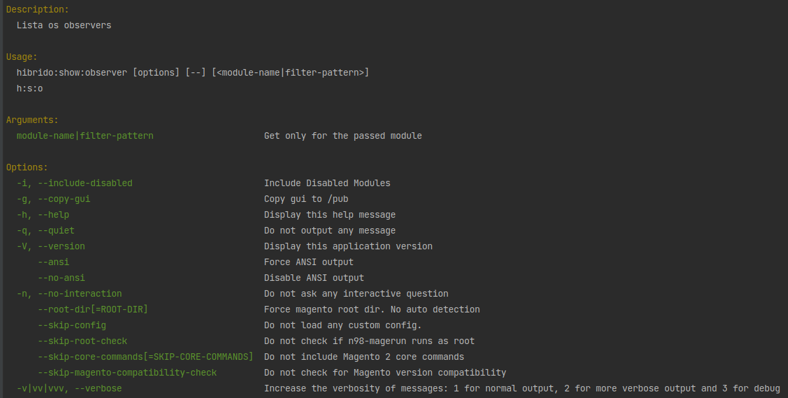
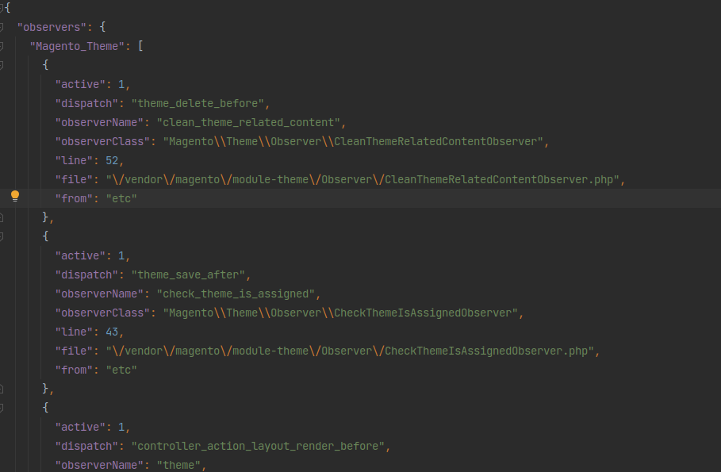
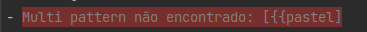
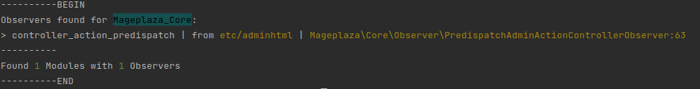

# Comandos de observers

- n98-magerun2 frobou:show:observer --help
    - mostra a ajuda do comando



- n98-magerun2 frobou:show:observer (tambem pode ser abreviado como ```n98-magerun f:s:o```)
    - mostra todos os observers
- n98-magerun2 frobou:show:observer frobou
    - mostra os observers para os módulos que contenham "frobou" no nome
- n98-magerun2 frobou:show:observer -i
  - mostra também os observers desativados
- n98-magerun2 frobou:show:observer -g
    - mostra os observers para os módulos que contenham "frobou" no nome e copia o conteúdo da pasta
      modules/frobou-gui para a pasta pub/gui do projeto em que o comando foi rodado

> O parâmetro -g sempre vai copiar todos os observers, não somente o que foi filtrado

**Estrutura do objeto de saída**



### Usando a busca pelo nome do módulo

> Apenas adicione o nome que deseja na linha de comando, nao precisa nem respeitar uma ordem

```
n98-magerun2 frobou:show:observer -g nome_a_ser_buscado -i
```

### Usando o pattern de busca

> Para usar o patern, adicione {{ no começo e separe os campos por :

> {{module_name:dispatch_name:observer_name:observer_class:status
> se quiser usar um campo específico, coloque os antecedentes entre :: ({{:dispatch_name)
> os campos posteriores não precisam ser declarados se não forem usados

- {{frobou
    - pesquisa por módulos que contenham a palavra "frobou" no nome
- {{frobou:collection
    - pesquisa por módulos que contenham a palavra "frobou" no nome e collection no campo method
- e assim por diante

### Facilidades

- buscar que recebem um texto são feitas usando regex, então pode usar ^hi[bX]do$ ({{^hi[bX]do$ também pode) que não tem
  problema
- campo status (0 ou 1) não usam regex, então passe o valor correto ou a busca vai falhar
- no caso do multi search (foi assim que chamei o {{) a busca ocorre da seguinte forma
    - resultado = todos os observers
    - se valor: pesquisa pelo module_name e guarda o novo resultado
    - se valor: pesquisa pelo status com o resultado do campo anterior como novo resultado
    - se valor: pesquisa pelo dispatch_name com o resultado do campo anterior como novo resultado
    - se valor: pesquisa pelo observer_name com o resultado do campo anterior como novo resultado
    - se valor: pesquisa pelo observer_class com o resultado do campo anterior como novo resultado
    - o novo resultado vai ser o filtro de tudo o que foi informado ou um erro bonito



Se tudo correu bem, temos isso:


