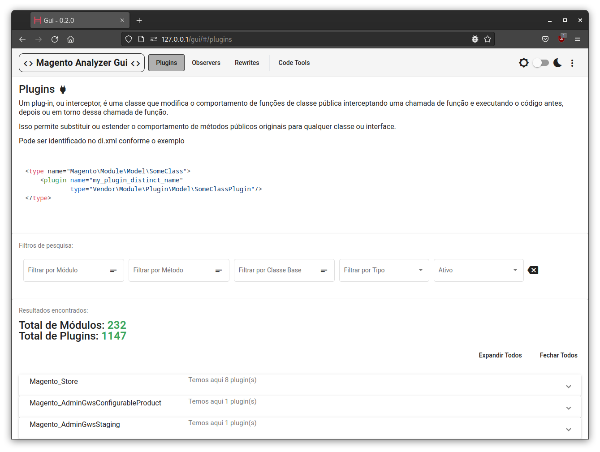
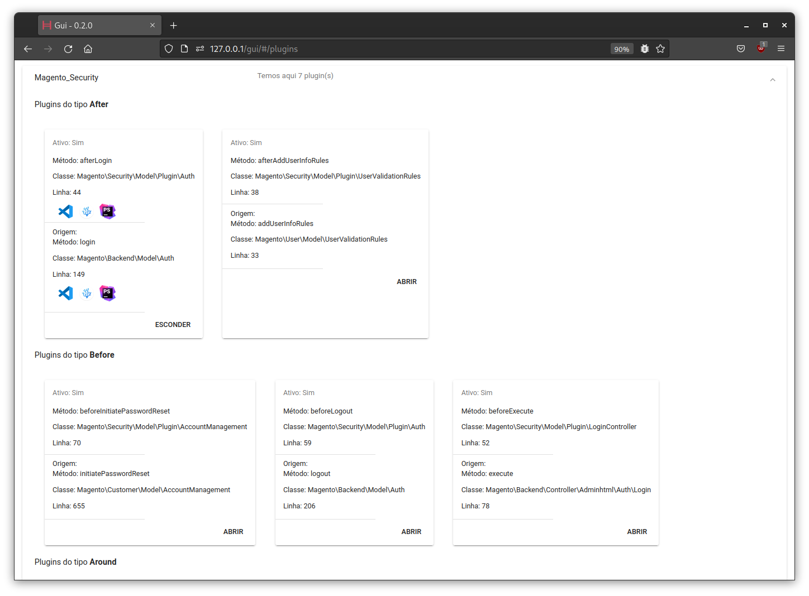
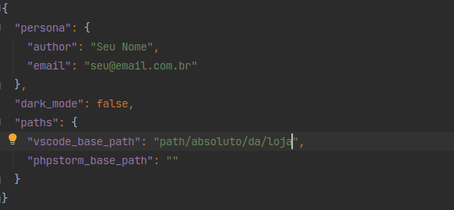
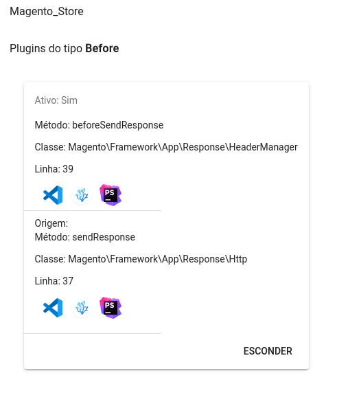
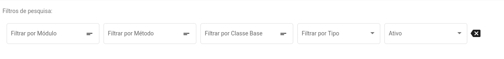

### GUI

## Somente uma tela para facilitra a vida

> Quando rodar algum comando com o -g, a pasta vai ser colocada em pu/gui, o que significa dizer que eu tenho uma interface "na loja"

### Sim, na loja

- rode os comandos para gerar os plugins e observers com o -g (sem isso os arquivos pub/gui/assets/ma-observers.json,
  pub/gui/assets/ma-plugins.json e pub/gui/assets/ma-rewrites.json podem não existir ou estarem vazios)
- abra a url da sua loja
- coloque um /gui no final e tecle <enter>
- bem-vindo

- Plugins: veja os plugins
- Observers: veja os observers
- Rewrites: veja os rewrites
- Code Tools: algumas coisas aqui
    - vai ter melhorias a adições com o tempo
    - sugestões e alterações são bem-vindas, mande para code@frobou.com.br
- sim, tem um dark mode
    - na pasta pub/gui/assets tem outro arquivo, o ma-gui-config.json, e ele é importante

> Assim são mostrados os plugins

> envie sugestões de layout e coisas mais bonitas para code@frobou.com.br, se tiver um código, eu agradeço...

### Ajustes

> Configure o arquivo ma-config.json ao seu gosto

**Mas tem uma ou duas coisinhas:**

- em persona, configure com os seus dados, vai ser util em Code Tools / file-headers
- dark_mode é o que parece mesmo
- theme é usado para fazer o highlight dos códigos, tem alguns pra escolher
  - pode ser: github, google, stackoverflow ou grayscale
  - mais podem aparecer no futuro
- em paths, temos uma configuração importante:
    - vscode_base_path:
        - deve ser o caminho completo da loja até antes do vendor
        - na prática, o camonho será preenchido automaticamente com esse prefixo + /vendor/magento-module/Arquivo.php
        - essa configuração também serve para o vscodium
    - phpstorm_base_path
        - para o phpstorm, a chamada é feita de forma diferente, então ficando em branco já tá certo

> Esqueci de dizer, mas voce pode abrir o arquivo de uma classe pela GUI, e ele abre na linha...

Por enquanto nessas 3 IDEs, talvez tenha mais alguma...

### Pesquisando

> Plugins, Observers e Rewrites tem o filtro de busca "parecidos"

> É uma pesquisa normal, comece a digitar e os dados vão mudando (existe um atraso de 500ms para que não tenha uma chamada a cada apertar de botão)

Mas os campos de texto tem uma particularidade

- clicando no ícone na direita do campo, entramos em modo regex (só nesse campo)
- agora digitamos a nossa regex complexa e apertamos <enter>
- para sair do modo regex é só clicar no ícone de novo
- a pesquisa funciona da mesma maneira que a cli

**Os campos do tipo select não tem essa funcionalidade, nem vão ter**
