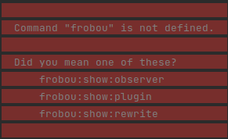

# Instalação

- Colocar o conteúdo da pasta modules no diretório de plugins do n98-magerun2

> Pasta /usr/local/share/n98-magerun2/modules (criar se não existir, como root)

```
sudo cp modules/* /usr/local/share/n98-magerun2/modules
```

- rodar os comandos - ver [plugins](cli-plugins.md) ou [observers](cli-observers.md)

> O plugin funciona em qualquer loja magento 2 e de forma independente, o que significa dizer que os dados gerados na loja X não serão os mesmos da loja Y

### No Docker

- Usar como volume no serviço que fornece o PHP
    - /pasta/do/repositorio/magento2-analyzer/modules:/usr/local/share/n98-magerun2/modules
- rodar os comandos (nesse caso só vai funcionar rodando dentro do container)

### Sobre as pastas

- pasta .docs
    - documentação
- pasta gui
    - projeto da interface em angular
- pasta modules
    - pasta frobou-gui
        - projeto angular compilado
    - pasta frobou-n98
        - projeto do plugin do n98-magerun

### Futuro

Se rodar apenas o comando ```n98-magerun2 frobou``` receberá um "erro"



> sugestões de features são bem-vindas, mande para code@frobou.com.br
